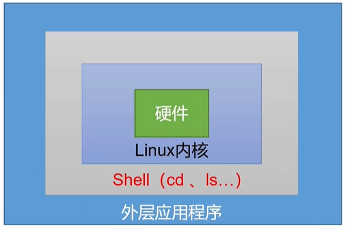

# 15.shell基础

# 一、shell概述

## shell介绍

shell是一个命令行解释器，它接收应用程序/用户命令，然后调用操作系统内核。



shell还是一个功能强大的编程语言，易编写、易调试、灵活性强。

## shell解析器

Linux提供的shell解析器有：

```shell
# cat /etc/shells

/bin/sh
/bin/bash
/usr/bin/sh
/usr/bin/bash
/bin/tcsh
/bin/csh
```

bash和sh的关系：其实sh就是bash的超链接

```shell
# ls -l /bin/sh
lrwxrwxrwx. 1 root root 4 Feb 24 14:50 /bin/sh -> bash
```

CentOS默认的解析器是：/bin/bash

```shell
# echo $SHELL
/bin/bash
```

## 入门案例

### 需求

编写一个shell脚本，运行后输出`hello wrold`

### 脚本格式

脚本以`#!/bin/bash`开头，目的是为了指定解析器。

### 脚本编写

```shell
# 创建脚本文件
# touch hello.sh

# 编辑文件
# vim hello.sh
写入如下内容
#!/bin/bash
echo "hello world"
```

### 脚本运行

运行shell脚本的方式有很多：

```shell
# 第一种
# 使用bash + 脚本的相对路径（不需要赋予文件执行权限）
# bash hello.sh

# 使用bash + 脚本的绝对路径（不需要赋予文件执行权限）
# bash /root/hello.sh

# 第二种
# 使用sh + 脚本的相对路径（不需要赋予文件执行权限）
# sh hello.sh

# 使用sh + 脚本的绝对路径（不需要赋予文件执行权限）
# sh /root/hello.sh

# 第三种
# 通过相对路径，直接执行脚本文件（需要赋予文件执行权限）
# chmod 755 hello.sh
# ./hello.sh

# 通过绝对路径，直接执行脚本文件（需要赋予文件执行权限）
# chmod 755 hello.sh
# /root/hello.sh

# 第四种
# 通过source命令 + 脚本的相对路径
# source hello.sh

# 通过source命令 + 脚本的绝对路径
# source /root/hello.sh

# 第五种
# 通过 . + 脚本的相对路径
# . hello.sh

# 通过 . + 脚本的绝对路径
# . /root/hello.sh
```

shell脚本的几种执行方式的区别：

前三种方式都是在当前Shell中打开一个子shell来执行脚本内容，当脚本内容结束，则子shell关闭，回到父shell中。

第四种和第五种，可以使脚本内容在当前shell里执行，无需打开子shell。这就是为什么我们每次修改完`/etc/profile`文件后，需要source一下的原因。

开子shell与不开子shell的区别在于，环境变量的继承关系，如在子shell中设置的当前变量，父shell是不可见的。

# 二、变量

变量就是内存中存储数据的一块区域！

## 系统预定义变量

也就是当我们打开shell终端后，系统内部就已经定义好的变量，供我们使用。

这些系统预定义变量有些是全局的、有些是局部的。

* $HOME：获取到当前用户家目录
* $PWD：打印当前的工作目录
* $SHELL：当前使用的shell解析器
* $USER：当前登录的用户
* 等等

```shell
# echo $HOME
/root

# echo $PWD
/root

# echo $SHELL
/bin/bash

# echo $USER
root
```

我们也可以使用如下命令查看系统中定义的全局变量（环境变量）：

```shell
# 查看系统中定义的全部的全局变量
# env | less

或者

# 查看系统中定义的全部的全局变量
# printenv | less

# 也可以查看某个全局变量的值，不需要加$符号
# printenv USER
root

# 显示当前用户家目录中的文件
# ls $HOME

# 查看当前shell中所有的变量（系统预定义的、用户自定义的都有）
# set | less
```

## 自定义变量

### 基本语法

定义变量：变量名=变量值，**注意：=号左右不能有空格**

```shell
# 定义变量
# a=5

# 使用变量
# echo $a
5

# 定义变量
# b=hello

# 使用变量
# echo $b
hello

# 给变量重新赋值
# b=HELLO

# 使用变量
# echo $b
HELLO

# 定义变量，如果变量值有特殊符号，需要使用单引号或者双引号引起来
# b="hello world"
# echo $b
hello world

# 定义变量
# myname=zhangsan

# 使用变量
# echo $myname
zhangsan

# 查看系统变量（全局变量）中是否有我们定义的变量，发现没有
# env | grep myname

# set中存放了所有的系统变量和局部变量（我们自定义的变量属于局部变量）
# set | grep myname
myname=zhangsan

# 开一个子shell
# bash

# 搜索与当前终端有关的进程
# ps -f
UID         PID   PPID  C STIME TTY          TIME CMD
root      21148  21119  0 18:31 pts/1    00:00:00 -bash
root      21590  21148  0 19:03 pts/1    00:00:00 bash => 可以看到当前我们已经在子shell中了
root      21643  21590  0 19:05 pts/1    00:00:00 ps -f

# 打印父shell中我们自定义的变量，发现没有值。说明我们父shell中定义的变量属于局部变量。
# 局部变量就是只能在当前shell中使用！
# echo $myname

# 退出当前的子shell
# exit
exit

# 使用export将自定义的变量由局部变量提升为全局变量，全局变量的话，其子shell中就可以访问到
# export myname

# 开一个子shell
# bash

# 打印父shell中自定义的变量，有值，也就是说父shell中定义的这个变量已经是全局变量了
# echo $myname
zhangsan

# 在子shell中更改父shell中定义的全局变量
myname="hello china"

# 子shell中，打印变量
# echo $myname
hello china

# 退出子shell
# exit
exit

# 在父shell中打印变量，发现子shell中修改的变量不会在父shell中生效
# echo $myname
zhangsan
```

**总结：**

* 在当前shell中，我们定义的变量属于局部变量；
* 局部变量只能在当前shell中使用，当前shell的子shell中是不能使用的；
* 可以使用`export 变量名`将变量由局部变量提升为全局变量；
* 全局变量在其子shell中是可以使用的；
* 子shell中修改的父shell中的全局变量后，子shell是可以使用修改后的值，但是父shell中该全局变量还是原来的值。也就是说在子shell中更改的不会影响到父shell。

> 我们定义的变量，默认都是字符串类型，比如：

```shell
# a=1
# a=1+3

# 可以看到自定义变量的类型默认是字符串的
# echo $a
1+3

# 如果要进行计算使用$(())的格式
# a=$((2+3))
# echo $a
5

# 或者使用$[]的格式进行数字计算
# a=$[2+5]
# echo $a
7
```

### 定义只读变量

只读变量就是只能看不能修改！

```shell
# 定义只读变量
# readonly b=18

# 给变量重新赋值
# b=20
-bash: b: readonly variable

# 使用变量
# echo $b
18
```

### 撤销变量

我们定义的变量都会放在内存中，变量如果过多，也会占用很大内存空间。

所以，使用完的变量，可以进行撤销。

注意：无论是系统定义的变量，还是我们自己定义的变量都会在 set 命令中看到！

```shell
# 定义变量
# my_age=18

# 使用变量
# echo $my_age
18

# 在set中搜索自定义的变量
# set | grep my_age
BASH_REMATCH=([0]="\$my_age" [1]="\$" [2]="my_age")
my_age=18

# 撤销变量
# unset my_age

# 在set中搜索自定义的变量，没有变量了
# set | grep my_age
BASH_REMATCH=([0]="\$my_age" [1]="\$" [2]="my_age")
_=my_age

# 定义只读变量
# readonly my_addr=shanxi

# 撤销只读变量，会报错，只读变量不能撤销
# unset my_addr
-bash: unset: my_addr: cannot unset: readonly variable
```

### 变量定义规则

* 变量名称可以由字母、数字和下划线组成，但是不能以数字开头，环境变量名建议大写
* 等号两侧不能有空格
* 在bash中，变量默认类型都是字符串类型，无法直接进行数值运算
* 变量的值如果有空格，需要使用双引号或单引号括起来

## 说明

我们在终端中输入的Linux命令，其实也是一个shell脚本文件。之所以能够直接执行这个脚本文件或命令，是因为我们将这个shell脚本文件放到了`/usr/bin`或者`/usr/sbin`目录中了，而这两个目录都配置到了环境变量中，当我们在终端中输入这两个目录下的命令时，系统就可以找到它们并执行。

```shell
# 查看Linux中配置的环境变量
# echo $PATH
/usr/local/sbin:/usr/local/bin:/usr/sbin:/usr/bin:/root/bin
```

如果我们将我们自己写的shell脚本文件放在`/usr/bin`目录中，那么也是可以直接当做命令去执行的！

## 特殊变量

### $n

我们的shell脚本文件在执行的时候是可以传递参数给脚本中的命令的。在脚本内容中可以通过`$n`来接收指定位置的参数。

$n，n是数字，$0代表该脚本名称，$1-$9代表第一个到第九个参数，十以上的参数需要使用大括号包含，比如${10}

案例1：创建一个脚本文件，在脚本中通过$n去接收第一个参数，然后输出。

```shell
[root@localhost ~]# touch test1.sh
[root@localhost ~]# vim test1.sh
脚本内容如下
#!/bin/bash
echo "hello $1"

[root@localhost ~]# chmod +x test1.sh
[root@localhost ~]# ./test1.sh zhangsan
hello zhangsan

[root@localhost ~]# ./test1.sh lisi
hello lisi
[root@localhost ~]#
```

案例2：创建一个脚本文件，在脚本中通过$n接收两个参数，然后输出。

```shell
[root@localhost ~]# touch test2.sh
[root@localhost ~]# vim test2.sh

#!/bin/bash
echo "测试参数的接收"
echo "脚本名称是：$0"
echo "第一个参数是：$1"
echo "第二个参数是：$2"

[root@localhost ~]# chmod 755 test2.sh

[root@localhost ~]# ./test2.sh abc xyz
测试参数的接收
脚本名称是：./test2.sh
第一个参数是：abc
第二个参数是：xyz
```

### $\#

$# 用于获取执行脚本时输入的参数的个数，常用于循环，判断参数的个数是否正确以及加强脚本的健壮性。

```shell
[root@localhost ~]# touch test3.sh

[root@localhost ~]# vim test3.sh
#!/bin/bash
echo "当前参数的个数是：$#"

[root@localhost ~]# chmod 755 test3.sh

[root@localhost ~]# ./test3.sh
当前参数的个数是：0

[root@localhost ~]# ./test3.sh 11 22 33
当前参数的个数是：3
```

### $\* 和 $@

$\* 代表命令行中所有的参数，$\* 把所有的参数看成一个整体

$@ 代表命令行中所有的参数，不过$@ 把每个参数区分对待（后面我们可以通过循环去遍历获取到的参数）

```shell
[root@localhost ~]# touch test4.sh

[root@localhost ~]# vim test4.sh
#!/bin/bash
echo "使用*获取到的参数是：$*"
echo "使用@获取到的参数是：$@"

[root@localhost ~]# chmod 755 test4.sh

[root@localhost ~]# ./test4.sh aaa bbb ccc
使用*获取到的参数是：aaa bbb ccc
使用@获取到的参数是：aaa bbb ccc
```

### $?

$? 表示上一次执行的命令的返回状态。如果返回的值是0，则上一个命令正确执行；如果返回的值为非0（至于具体是哪个数，由命令自己决定），则上一个命令执行不正确。

```shell
[root@localhost ~]# cd ~
[root@localhost ~]# echo $?
0

[root@localhost ~]# ./test1.sh
hello
[root@localhost ~]# echo $?
0

[root@localhost ~]# abc
bash: abc: command not found...
[root@localhost ~]# echo $?
127
```

# 三、运算符

## expr（了解）

在之前的内容中，我们也提到过，在shell中定义一个变量，它默认的数据类型是字符串的，也就是如果我们定义一个数字的表达式，它是不能进行计算的。比如：

```shell
[root@localhost ~]# num1=1+3
[root@localhost ~]# echo $num1
1+3
```

如果我们要进行计算，可以使用`expr`命令，它其实是一个函数

```shell
# expr是一个函数，可以进行计算，这里是将1、+ 和 2作为参数传递给expr函数了，所以1 + 2 它们之间要有空格
[root@localhost ~]# expr 1 + 2
3

[root@localhost ~]# expr 5 - 3
2

# *号在shell中有特殊含义，比如$*、通配符等，所以计算乘法时需要给*加转义
[root@localhost ~]# expr 2 * 3
expr: syntax error

[root@localhost ~]# expr 3 \* 5
15
```

## $()

我们一般是要将运算的结果赋值给某个变量的。`$(表达式)`可以将表达式的结果赋值给一个变量或者`表达式`也可以

```shell
# 直接将expr的结果赋值给num1，是会报错的，shell认为num1是一个命令
[root@localhost ~]# num1 = expr 2 + 3
bash: num1: command not found...

# 将右边表达式的结果赋值给变量
[root@localhost ~]# num1=$(expr 2 + 3)
[root@localhost ~]# echo $num1
5

# 将右边表达式的结果赋值给变量
[root@localhost ~]# num1=`expr 3 + 5`
[root@localhost ~]# echo $num1
8
```

## $(())与$\[]

上面的expr函数可以进行运算，但是有点麻烦，我们也可以使用：`$((运算式))`或`$[运算式]`来进行运算。

```shell
[root@localhost ~]# echo $((3*5))
15

[root@localhost ~]# echo $[6+7]
13

[root@localhost ~]# num1=$[3+5]
[root@localhost ~]# echo $num1
8
```

案例：计算（2+5）\* 6，然后赋值给变量sum

```shell
[root@localhost ~]# sum=$[(2+5)*6]
[root@localhost ~]# echo $sum
42
```

案例：编写一个计算两数和的脚本

```shell
[root@localhost ~]# touch test5.sh

[root@localhost ~]# vim test5.sh
#!/bin/bash
sum=$[$1 + $2]
echo "结果是：$sum"

[root@localhost ~]# chmod +x test5.sh

[root@localhost ~]# ./test5.sh 15 20
结果是：35
```


> 更新: 2025-03-20 09:04:55  
> 原文: <https://www.yuque.com/u41736172/az9urv/tvdlrblsmvtc3632>