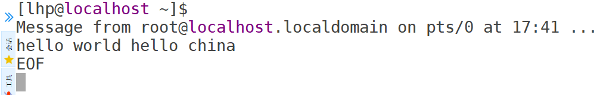

# 17.shell高级

# 一、函数

函数：就是一段代码的集合，目的是为了实现某个功能。

我们可以通过调用函数，并传入一些参数，然后函数会将得到的结果给我们返回。

案例：编写一个脚本，接收一个参数作为文件名，返回一个处理后的文件名，带上日期时间后缀

```shell
[root@localhost ~]# touch test.sh

[root@localhost ~]# vim test.sh
#!/bin/bash
# $(命令) 会将命令进行执行然后得到结果； date +%s 得到当前日期的时间戳
filename="$1"_log_$(date +%s)
echo $filename

[root@localhost ~]# chmod +x test.sh

[root@localhost ~]# ./test.sh helloworld
helloworld_log_1741247277
```

其实我们之前学习的各种命令也可以认为是函数，我们在输入命令后，进行执行，其实就是调用函数的过程，然后函数会给我们返回一些结果。比如上面的`date +%s`其实就可以看做是调用系统内部的`date`函数，然后传入参数`%s`，得到一个返回结果时间戳。

我们最近编写的shell脚本也类似于函数，shell脚本就是为了实现一些功能而写的代码集合，只不过是脚本的执行比较麻烦，还得先给执行权限，然后再调用，而函数的使用就比较方便了，直接调用即可。

## 系统函数

### basename

作用：basename命令会删除所有的前缀包括最后一个`/`字符，然后将字符串显示出来。

basename可以理解为获取路径里的文件名称

```shell
basename [string/pathname] [suffix]
选项说明：
suffix为后缀，如果suffix被指定了，basename会将pathname或string中的suffix去掉
```

案例：之前我们学习过$n可以获取执行脚本时输入的参数，$0可以获取到脚本名称，但我们需要对脚本名称做一些处理才能获取到真正的脚本名称！！！可以使用basename函数处理。

```shell
[root@localhost ~]# touch test.sh

[root@localhost ~]# vim test.sh
#!/bin/bash
echo $0

[root@localhost ~]# chmod +x test.sh

[root@localhost ~]# ./test.sh
./test.sh	=> 得到的是执行脚本时的相对路径

[root@localhost ~]# /root/test.sh
/root/test.sh => 得到的是执行脚本时的绝对路径
```

案例：basename简单使用

```shell
[root@localhost ~]# basename /root/test.sh
test.sh

[root@localhost ~]# basename /abc/xyz/jqk
jqk

可以理解为：basename函数就是找的文件路径中最后一个 / 后面的内容

这里是将后缀也给去掉了
[root@localhost ~]# basename /root/test.sh .sh
test

[root@localhost ~]# basename /root/tmp/abc.txt .txt
abc
```

案例：改造上面的文件日志，带时间戳的案例

```shell
[root@localhost ~]# touch test.sh

[root@localhost ~]# vim test.sh
#!/bin/bash

echo $(basename $0 .sh)_log_$(date +%s)

[root@localhost ~]# chmod +x test.sh

[root@localhost ~]# ./test.sh
test_log_1741248775

[root@localhost ~]# /root/test.sh
test_log_1741248779
```

### dirname

作用：从给定的包含绝对路径的文件名中去除文件名（非目录的部分），然后返回剩下的路径（目录的部分）

```shell
dirname 文件绝对路径
```

dirname可以理解为获取文件路径中的绝对路径。

```shell
# dirname其实就是获取到文件路径中最后一个 / 之前的内容
[root@localhost ~]# dirname /root/test.sh
/root

[root@localhost ~]# dirname /abc/xyz/jqk.txt
/abc/xyz

[root@localhost ~]# dirname ../abc/xxx/yyy
../abc/xxx
```

案例：编写脚本，获取脚本名称以及脚本的所在目录完整路径。

```shell
[root@localhost ~]# touch test.sh

[root@localhost ~]# vim test.sh

#!/bin/bash
echo "当前脚本的名称是：$(basename $0 .sh)"
cd $(dirname $0)	=> 获取所在目录时，因为有可能是通过相对路径执行的脚本，所以我们稍作处理
echo "当前脚本所在目录是：$(pwd)"

[root@localhost ~]# chmod +x test.sh

[root@localhost ~]# ./test.sh
当前脚本的名称是：test
当前脚本所在目录是：/root
```

## 自定义函数

```shell
[function] 函数名称 [()]
{
  函数体;
  [return 数值;]
}
```

自定义函数注意事项：

1. 必须在调用函数地方之前，先声明函数，shell脚本是逐行运行的。
2. 函数返回值，只能通过$?系统变量获取，可以显式加：`return`返回，如果不加，将以最后一条命令运行结果，作为返回值。return 后跟的数值为`0-255`之间的。

案例：编写函数计算两个数之和

```shell
[root@localhost ~]# touch test.sh

[root@localhost ~]# vim test.sh
#!/bin/bash

function sum(){ => 定义函数
        sum=$[$1 + $2]
        echo "和是：$sum"
}

read -p "请输入第一个数字：" num1
read -p "请输入第二个数字：" num2

sum $num1 $num2		=> 调用函数，传递参数

[root@localhost ~]# chmod +x test.sh

[root@localhost ~]# ./test.sh
请输入第一个数字：5
请输入第二个数字：3
和是：8
```

案例：改造上面的案例

```shell
[root@localhost ~]# touch test.sh

[root@localhost ~]# vim test.sh
#!/bin/bash

function sum (){
        sum=$[$1+$2]
        echo $sum	=> 函数没有写返回值，就会将函数体最后一条命令结果返回
}

read -p "请输入第一个数字：" num1
read -p "请输入第二个数字：" num2

result=$(sum $num1 $num2) => 调用函数，得到上面函数的返回结果
echo "结果是：$result"

[root@localhost ~]# chmod +x test.sh

[root@localhost ~]# ./test.sh
请输入第一个数字：20
请输入第二个数字：30
结果是：50
```

# 二、综合案例-归档文件

## 需求说明

实际生产应用中，我们往往需要对重要数据进行归档备份。

需求：实现一个每天对指定目录归档备份的脚本，输入一个目录完整路径（末尾不带/），将目录下所有文件按天归档保存，并将归档日期附加在归档文件名上，放在`/root/archive`下。

这里会用到压缩命令：tar，后面可以加上`-c`选项表示打包，加上`-z`选项表示压缩，得到的文件后缀名是`.tar.gz`。

## 脚本实现

注意，我们本次写的脚本可能是实际工作中要用的，所以我们要考虑的多些、严谨些。

```shell
[root@localhost ~]# touch daily_archive.sh

[root@localhost ~]# vim daily_archive.sh
#!/bin/bash

# 判断输入的参数是不是只有一个
if [ $# -ne 1 ]
then
        echo "参数输入有误，应该输入一个参数，作为归档目录"
        exit
fi

# 判断输入的目录路径是否存在
if [ -d $1 ]
then
        echo
else
        echo "目录不存在或者不是一个目录"
        exit
fi

# 获取到归档的文件夹的名称
dir_name=$(basename $1)

# 获取到归档的文件夹所在的目录的完整路径
dir_path=$(cd $(dirname $1);pwd)

# 获取当前的日期并格式化
now_date=$(date +%y%m%d)

# 定义生成的归档文件的名称
filename=${dir_name}_bak_${now_date}.tar.gz

# 定义最终归档文件所在全路径
dest=/root/archive/$filename

# 开始归档文件
tar -zcf $dest $dir_path/$dir_name

# 判断是否归档成功
if [ $? ]
then
        echo "归档成功，归档文件为：$dest"
else
        echo "归档失败"
fi

[root@localhost ~]# chmod +x daily_archive.sh

[root@localhost ~]# mkdir /root/archive

[root@localhost ~]# mkdir shop

[root@localhost ~]# touch shop/admin.php shop/config.php shop/index.php

[root@localhost ~]# ./daily_archive.sh
参数输入有误，应该输入一个参数，作为归档目录

[root@localhost ~]# ./daily_archive.sh a b
参数输入有误，应该输入一个参数，作为归档目录

[root@localhost ~]# ./daily_archive.sh /root/shop
tar: Removing leading `/' from member names
归档成功，归档文件为：/root/archive/shop_bak_250307.tar.gz

[root@localhost ~]# ls /root/archive/
shop_bak_250307.tar.gz

[root@localhost ~]# tar -tf /root/archive/shop_bak_250307.tar.gz
root/shop/
root/shop/admin.php
root/shop/config.php
root/shop/index.php
```

## 定时备份

实际工作中，我们可能是需要定时备份的，所以可以编写一个定时任务去执行上面的脚本。

```shell
# 查看目前的定时任务
[root@localhost ~]# crontab -l
no crontab for root

[root@localhost ~]# crontab -e
0 2 * * * /root/daily_archive.sh /root/shop => 每天凌晨两点执行定时任务

[root@localhost ~]# crontab -l
0 2 * * * /root/daily_archive.sh /root/shop
```

# 三、正则表达式

正则表达式使用单个字符串来描述、匹配一系列符合某个语法规则的字符串。在很多文本编辑器里，正则表达式通常被用来检索、替换那些符合某个模式的文本。在Linux中，grep，sed，awk等文本处理工具都支持通过正则表达式进行模式匹配。

## 常规匹配

一串不包含特殊字符的正则表达式匹配它自己，比如：

```shell
[root@localhost ~]# cat /etc/passwd | grep lhp
lhp:x:1000:1000:lhp:/home/lhp:/bin/bash
```

就会匹配所有包含lhp的行。

## 常用特殊字符

### 特殊字符 ^

^ 匹配一行的开头，比如：

```shell
# 匹配以a开头的行
[root@localhost ~]# cat /etc/passwd | grep ^a
adm:x:3:4:adm:/var/adm:/sbin/nologin
amandabackup:x:33:6:Amanda user:/var/lib/amanda:/bin/bash
abrt:x:173:173::/etc/abrt:/sbin/nologin
avahi:x:70:70:Avahi mDNS/DNS-SD Stack:/var/run/avahi-daemon:/sbin/nologin

# 匹配以ab开头的行
[root@localhost ~]# cat /etc/passwd | grep ^ab
abrt:x:173:173::/etc/abrt:/sbin/nologin
```

### 特殊字符 $

$ 匹配一行的结束，比如：

```shell
# 匹配以bash结尾的行
[root@localhost ~]# cat /etc/passwd | grep bash$
root:x:0:0:root:/root:/bin/bash
amandabackup:x:33:6:Amanda user:/var/lib/amanda:/bin/bash
lhp:x:1000:1000:lhp:/home/lhp:/bin/bash
user1:x:1001:1001::/home/user1:/bin/bash
user2:x:1002:1002::/home/user2:/bin/bash
user3:x:1003:1003::/home/user3:/bin/bash
wangwu:x:1007:1005::/home/wangwu:/bin/bash
```

```shell
# ^abash$ 是匹配一行必须是abash，所以没有输出
[root@localhost ~]# cat /etc/passwd | grep ^abash$
[root@localhost ~]#
```

```shell
# ^$ 匹配空行的
[root@localhost ~]# cat /etc/passwd | grep ^$
[root@localhost ~]#

[root@localhost ~]# cat daily_archive.sh | grep ^$


[root@localhost ~]#

# 匹配空行，并显示空行的行号
[root@localhost ~]# cat daily_archive.sh | grep -n ^$
2:
9:
18:
21:
24:
27:
30:
33:
36:
44:
45:
[root@localhost ~]#
```

### 特殊字符 .

`.`匹配一个任意的字符，比如：

```shell
# 匹配包含 r..t 的行，r和t之间是任意的两个字符
[root@localhost ~]# cat /etc/passwd | grep r..t
root:x:0:0:root:/root:/bin/bash
operator:x:11:0:operator:/root:/sbin/nologin
ftp:x:14:50:FTP User:/var/ftp:/sbin/nologin

[root@localhost ~]# cat /etc/passwd | grep r...t
rtkit:x:172:172:RealtimeKit:/proc:/sbin/nologin
unbound:x:993:988:Unbound DNS resolver:/etc/unbound:/sbin/nologin
```

### 特殊字符 \*

`*`不单独使用，它和上一个字符连用，表示匹配上一个字符0次或多次，比如：

```shell
# ro*t 其实可以匹配到的有：rt、rot、root、rooot等
[root@localhost ~]# cat /etc/passwd | grep ro*t
root:x:0:0:root:/root:/bin/bash
operator:x:11:0:operator:/root:/sbin/nologin
abrt:x:173:173::/etc/abrt:/sbin/nologin
rtkit:x:172:172:RealtimeKit:/proc:/sbin/nologin
```

思考：`.*`可以匹配什么？

答：`.*`匹配任意的字符串（`.`代表任意一个字符，`*`代表前面那个字符出现0次或多次）

```shell
# ^a.*in$ 匹配以a开头，以in结尾的行
[root@localhost ~]# cat /etc/passwd | grep ^a.*in$
adm:x:3:4:adm:/var/adm:/sbin/nologin
abrt:x:173:173::/etc/abrt:/sbin/nologin
avahi:x:70:70:Avahi mDNS/DNS-SD Stack:/var/run/avahi-daemon:/sbin/nologin
```

```shell
# ^a.*var.*in$ 匹配以a开头，以in结尾，中间包含var的行
# cat /etc/passwd | grep ^a.*var.*in$
adm:x:3:4:adm:/var/adm:/sbin/nologin
avahi:x:70:70:Avahi mDNS/DNS-SD Stack:/var/run/avahi-daemon:/sbin/nologin
```

### 字符区间(中括号) \[]

`[ ]`表示匹配某个范围内的任意一个字符，例如：

* `[6,8]`表示匹配6或者8（也可以写为`[68]`）
* `[0-9]`表示匹配0-9的任意一个数字
* `[0-9]*`表示匹配任意长度的数字字符串
* `[a-z]`表示匹配a-z之间的任意一个字符
* `[a-z]*`表示匹配任意长度的字母字符串
* `[a-c,e-f]`表示匹配a-c或者e-f之间的任意一个字符

```shell
# r[a,b]t 匹配包含rat或者rbt的行
[root@localhost ~]# cat /etc/passwd | grep r[a,b]t
operator:x:11:0:operator:/root:/sbin/nologin
sshd:x:74:74:Privilege-separated SSH:/var/empty/sshd:/sbin/nologin

[root@localhost ~]# cat /etc/passwd | grep r[ab]*t
operator:x:11:0:operator:/root:/sbin/nologin
abrt:x:173:173::/etc/abrt:/sbin/nologin
rtkit:x:172:172:RealtimeKit:/proc:/sbin/nologin
sshd:x:74:74:Privilege-separated SSH:/var/empty/sshd:/sbin/nologin

[root@localhost ~]# cat /etc/passwd | grep r[a-z]*t
root:x:0:0:root:/root:/bin/bash
operator:x:11:0:operator:/root:/sbin/nologin
libstoragemgmt:x:998:995:daemon account for libstoragemgmt:/var/run/lsm:/sbin/nologin
abrt:x:173:173::/etc/abrt:/sbin/nologin
rtkit:x:172:172:RealtimeKit:/proc:/sbin/nologin
setroubleshoot:x:989:983::/var/lib/setroubleshoot:/sbin/nologin
sshd:x:74:74:Privilege-separated SSH:/var/empty/sshd:/sbin/nologin
```

### 转义字符

`\`表示转义，并不会单独使用。由于所有特殊字符都有其特定匹配模式，当我们想匹配某一特殊字符本身时(例如，我想找出所有包含`$`的行)，就会碰到困难。此时我们就要将转义字符和特殊字符连用，来表示特殊字符本身，例如：

```shell
# 在文档中搜索包含$的行，注意需要使用单引号引起来，双引号可不行
[root@localhost ~]# cat daily_archive.sh | grep '\$'
if [ $# -ne 1 ]
if [ -d $1 ]
dir_name=$(basename $1)
dir_path=$(cd $(dirname $1);pwd)
now_date=$(date +%y%m%d)
filename=${dir_name}_bak_${now_date}.tar.gz
dest=/root/archive/$filename
tar -zcf $dest $dir_path/$dir_name
if [ $? ]
        echo "归档成功，归档文件为：$dest"
```

```shell
# 匹配手机号
[root@localhost ~]# echo "15201008359" | grep ^1[34578][0-9][0-9][0-9][0-9][0-9][0-9][0-9][0-9][0-9]$
15201008359

[root@localhost ~]# echo "10201008359" | grep ^1[34578][0-9][0-9][0-9][0-9][0-9][0-9][0-9][0-9][0-9]$

[root@localhost ~]# echo "18201008359" | grep ^1[34578][0-9][0-9][0-9][0-9][0-9][0-9][0-9][0-9][0-9]$
18201008359

# 选项-E表示支持扩展的写法，比如 {n,m}、?、+ 等特殊符号
[root@localhost ~]# echo "18201008359" | grep -E ^1[34578][0-9]{9}$
18201008359
```

# 四、文本处理工具

## cut

cut的工作就是“剪”，具体的说就是在文件中负责剪切数据用的。cut命令从文件的每一行剪切字节、字符和字段并将这些字节、字符和字段输出。

```shell
# cut [选项] filename
默认分隔符是制表符

选项说明：
-f：列号，提取第几列
-d：分隔符，按照指定分隔符分隔列，默认是制表符"\t"
-c：按字符进行分割，后加n表示提取第几列，比如：-c 1
```

```shell
[root@localhost ~]# touch test.txt

[root@localhost ~]# vim test.txt
a1 a2 a3
b1 b2 b3
c1 c2 c3

[root@localhost ~]# cat test.txt
a1 a2 a3
b1 b2 b3
c1 c2 c3

# 使用一个空格去分割内容，要提取第1列
[root@localhost ~]# cut -d " " -f 1 test.txt
a1
b1
c1

# 使用一个空格去分割内容，要提取第2、3列
[root@localhost ~]# cut -d " " -f 2,3 test.txt
a2 a3
b2 b3
c2 c3

# 使用cat命令查看文件内容，然后通过grep搜索指定内容，最后通过cut分割，按照：分割，提取第1、6、7列内容
[root@localhost ~]# cat /etc/passwd | grep bash$ | cut -d ":" -f 1,6,7
root:/root:/bin/bash
amandabackup:/var/lib/amanda:/bin/bash
lhp:/home/lhp:/bin/bash
user1:/home/user1:/bin/bash
user2:/home/user2:/bin/bash
user3:/home/user3:/bin/bash
wangwu:/home/wangwu:/bin/bash

# 提取第1到3列
[root@localhost ~]# cat /etc/passwd | grep bash$ | cut -d ":" -f 1-3
root:x:0
amandabackup:x:33
lhp:x:1000
user1:x:1001
user2:x:1002
user3:x:1003
wangwu:x:1007

# 提取第4列到最后
[root@localhost ~]# cat /etc/passwd | grep bash$ | cut -d ":" -f 4-
0:root:/root:/bin/bash
6:Amanda user:/var/lib/amanda:/bin/bash
1000:lhp:/home/lhp:/bin/bash
1001::/home/user1:/bin/bash
1002::/home/user2:/bin/bash
1003::/home/user3:/bin/bash
1005::/home/wangwu:/bin/bash

# 打印系统环境变量的值
[root@localhost ~]# echo $PATH
/usr/local/sbin:/usr/local/bin:/usr/sbin:/usr/bin:/root/bin

# 按:分割，提取第2列往后的内容
[root@localhost ~]# echo $PATH | cut -d ":" -f 2-
/usr/local/bin:/usr/sbin:/usr/bin:/root/bin

# -------------提取网卡IP地址--------------
# 1.查看ip地址
[root@localhost ~]# ifconfig

# 2.查看指定网卡的ip信息
[root@localhost ~]# ifconfig ens33
ens33: flags=4163<UP,BROADCAST,RUNNING,MULTICAST>  mtu 1500
        inet 192.168.126.137  netmask 255.255.255.0  broadcast 192.168.126.255
        inet6 fe80::20c:29ff:fed8:91cd  prefixlen 64  scopeid 0x20<link>
        ether 00:0c:29:d8:91:cd  txqueuelen 1000  (Ethernet)
        RX packets 13473  bytes 1086002 (1.0 MiB)
        RX errors 0  dropped 0  overruns 0  frame 0
        TX packets 6324  bytes 699467 (683.0 KiB)
        TX errors 0  dropped 0 overruns 0  carrier 0  collisions 0

# 3.搜索指定的内容
[root@localhost ~]# ifconfig ens33 | grep netmask
        inet 192.168.126.137  netmask 255.255.255.0  broadcast 192.168.126.255

# 4.按照空格分割，提取第10列内容，就是我们想要的IP地址
[root@localhost ~]# ifconfig ens33 | grep netmask | cut -d " " -f 10
192.168.126.137

# 提取所有的ip地址
[root@localhost ~]# ifconfig | grep netmask | cut -d " " -f 10
192.168.126.137
127.0.0.1
192.168.122.1
```

## awk（上）

一个强大的文本分析工具，把文件逐行的读取，以空格为默认分隔符将每行切片，切开的部分再进行分析处理。

```shell
# awk [选项] '/pattern1/{action1} /pattern2/{action2}...' filename

pattern：表示awk在数据中查找的内容，就是匹配模式
action：在找到匹配内容时所执行的一系列命令

选项说明：
-F：指定文件分隔符
-v：赋值一个用户定义变量

注意：如果正则表达式匹配成功后，才会执行后面{}中的代码的！
awk默认按照空格进行分割，多个空格会当做一个进行分割
```

案例：

```shell
# 搜索/etc/passwd文件中以root开头的行的第7列内容
[root@localhost ~]# cat /etc/passwd | grep ^root | cut -d ":" -f 7
/bin/bash

# 搜索/etc/passwd文件中以root开头的行的第7列内容
# awk命令说明，以冒号分割每行内容，然后匹配到以root开头的行，打印分割后的第7列
[root@localhost ~]# cat /etc/passwd | awk -F ":" '/^root/{print $7}'
/bin/bash

# 搜索passwd文件以root关键字开头的所有行，并输出该行的第1列和第7列， 中间以","号分隔
[root@localhost ~]# cat /etc/passwd | awk -F ":" '/^root/{print $1","$7}'
root,/bin/bash

# 只显示/etc/passwd的前5行的第一列和第七列，以逗号分隔，且在所有行前面添加列名"user,shell"，在最后一行添加"hello,world!"
[root@localhost ~]# tail -5 /etc/passwd | awk -F ":" 'BEGIN{print "user,shell"}{print $1","$7}END{print "hello,world"}'
user,shell
user1,/bin/bash
user2,/bin/bash
user3,/bin/bash
linuxuser,/sbin/nologin
wangwu,/bin/bash
hello,world

# BEIGN是在所有行之前执行，END是在所有行之后执行，{}就可以看做是代码块，里面可以写很多代码命令
```

```shell
# 将passwd文件中后三行的用户id增加数值1，并输出
[root@localhost ~]# tail -3 /etc/passwd | awk -F ":" '{print $3+1}'
1004
1005
1008

# 将passwd文件中后三行的用户id增加数值1，并输出，通过定义变量的方式，这样更灵活，以后如果id要+2，+3都可以
[root@localhost ~]# tail -3 /etc/passwd | awk -v i=1 -F ":" '{print $3+i}'
1004
1005
1008
```

## awk（下）

awk命令还有一些内置变量：

| 变量 | 说明 |
| --- | --- |
| FILENAME | 文件名 |
| NR | 已读的记录数（行号） |
| NF | 浏览记录的域的个数（切割后，列的个数） |

案例1：统计passwd文件名，每行的行号，每行的列数

```shell
# 使用awk命令，打印出/etc/passwd文件的文件名、行号、列数（也可以用之前管道符的写法，不过就打不出文件名了！）
[root@localhost ~]# awk -F ":" '{print "文件名："FILENAME "行号："NR "列数："NF}' /etc/passwd
文件名：/etc/passwd行号：1列数：7
文件名：/etc/passwd行号：2列数：7
文件名：/etc/passwd行号：3列数：7
文件名：/etc/passwd行号：4列数：7
文件名：/etc/passwd行号：5列数：7
```

案例2：查询ifconfig命令输出结果中的空行所在的行号

```shell
[root@localhost ~]# ifconfig | grep -n ^$
9:
18:
26:

[root@localhost ~]# ifconfig | awk '/^$/{print NR}'
9
18
26
```

案例3：切割IP

```shell
[root@localhost ~]# ifconfig ens33 | grep netmask | cut -d " " -f 10
192.168.126.137

[root@localhost ~]# ifconfig | grep netmask | cut -d " " -f 10
192.168.126.137
127.0.0.1
192.168.122.1

[root@localhost ~]# ifconfig | awk -F " " '/netmask/{print $2}'
192.168.126.137
127.0.0.1
192.168.122.1
```

# 五、综合案例

## 需求说明

我们可以利用 Linux 自带的 mesg 和 write 工具，向其它用户发送消息。

需求: 实现一个向某个用户快速发送消息的脚本，输入用户名作为第一个参数，后面直接跟要发送的消息。脚本需要检测用户是否登录在系统中、是否打开消息功能，以及当前发送消息是否为空。

## 内容回顾

```shell
# 查看当前登录的用户名
[root@localhost ~]# whoami
root

# 查看当前登录的用户的详细信息
[root@localhost ~]# who am i
root     pts/0        2025-03-08 13:31 (192.168.126.1)

# 查看当前所有登录到系统的用户详细信息
[root@localhost ~]# who
root     pts/0        2025-03-08 13:31 (192.168.126.1)
lhp      pts/1        2025-03-08 16:24 (192.168.126.1)

# 查看当前用户的消息是否打开
[root@localhost ~]# mesg
is y => 消息功能是打开的

# 查看所有登录的用户的消息是否打开，+ 表示打开
[lhp@localhost ~]$ who -T
root     + pts/0        2025-03-08 13:31 (192.168.126.1)
lhp      + pts/1        2025-03-08 16:24 (192.168.126.1)

# 关闭当前用户消息功能
[lhp@localhost ~]$ mesg n

# 查看所有登录的用户的消息是否打开，+ 表示打开，-表示关闭
[lhp@localhost ~]$ who -T
root     + pts/0        2025-03-08 13:31 (192.168.126.1)
lhp      - pts/1        2025-03-08 16:24 (192.168.126.1)

# 打开当前用户消息功能
[lhp@localhost ~]$ mesg y

# 在root终端，给lhp终端发送消息
[root@localhost ~]# write lhp pts/1
hello,lhp~

# 在lhp终端收到了消息
[lhp@localhost ~]$
Message from root@localhost.localdomain on pts/0 at 16:30 ...
hello,lhp~
```

## 脚本实现

```shell
[root@localhost ~]# touch send_msg.sh

[root@localhost ~]# vim send_msg.sh
#!/bin/bash

# 在执行脚本的时候，需要传入至少两个参数，第一个参数，表示要给谁发送消息，第二个以
后的参数表示要发送的消息内容
# 查看对方是否在线，注意对方有可能在多个终端登录了，我们只取第一个
# -i 表示忽略大小写，-m 表示匹配几行
login_user=$(who | grep -i -m 1 $1 | awk '{print $1}')

# 判断对方用户是否在线, -z 用来判断变量是否为空
if [ -z $login_user ]
then
        echo "$1不在线，脚本退出..."
        exit
fi

# 判断对方是否开启了消息功能，得到的是 - 或者 +
is_allowed=$(who -T | grep -i -m 1 $1 | awk '{print $2}')

# 判断is_allowed的值
if [ $is_allowed != "+" ]
then
        echo "$1没有开启消息功能，脚本退出..."
        exit
fi

# 判断是否有传入了要发送的消息内容
if [ -z $2 ]
then
        echo "没有发送的消息，脚本退出..."
        exit
fi

# 从参数中获取到发送的消息，是从第2个参数开始都是要发送的消息
send_msg=$(echo $* | cut -d " " -f 2-)

# 获取用户登录的终端
user_terminal=$(who -T | grep $1 | awk '{print $3}')

# 发送消息
echo $send_msg | write $login_user $user_terminal

# 判断消息是否发送成功
if [ $? != 0 ]
then
        echo "发送失败"
else
        echo "发送成功"
fi

[root@localhost ~]# chmod +x send_msg.sh

[root@localhost ~]# ./send_msg.sh
Usage: grep [OPTION]... PATTERN [FILE]...
Try 'grep --help' for more information.
不在线，脚本退出...

[root@localhost ~]# ./send_msg.sh zhangsan
zhangsan不在线，脚本退出...

[root@localhost ~]# ./send_msg.sh lhp
没有发送的消息，脚本退出...

[root@localhost ~]# ./send_msg.sh lhp hello world hello china
发送成功
```

lhp客户端界面效果如下：




> 更新: 2025-03-21 09:11:26  
> 原文: <https://www.yuque.com/u41736172/az9urv/wsvdusyhrw4ilutc>