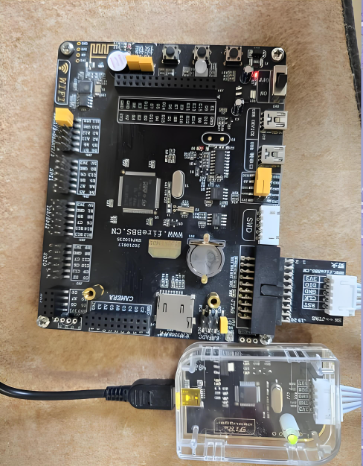
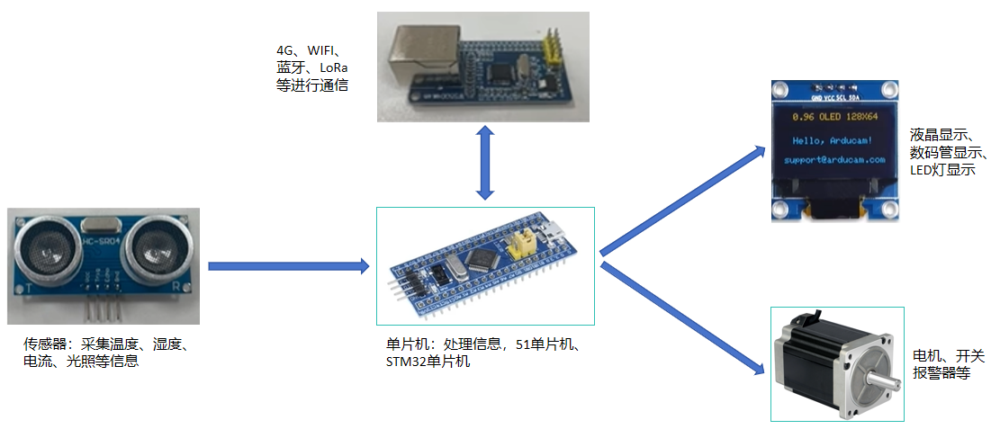
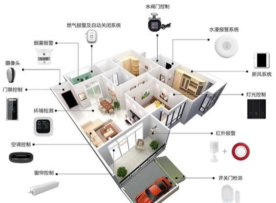
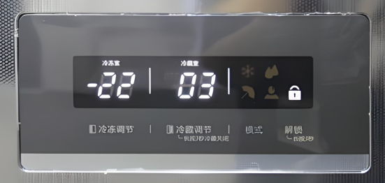
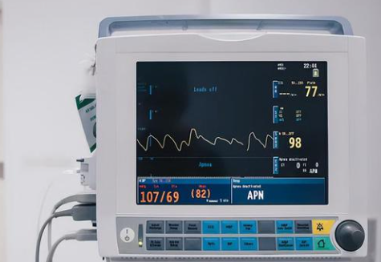
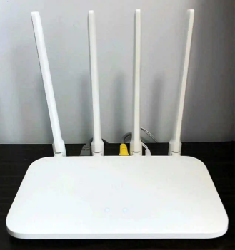
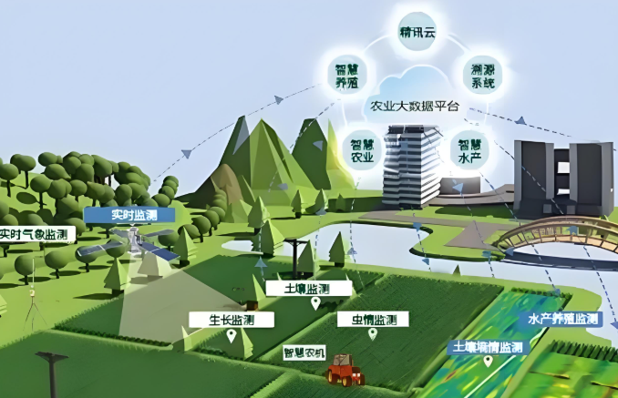
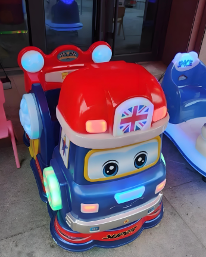
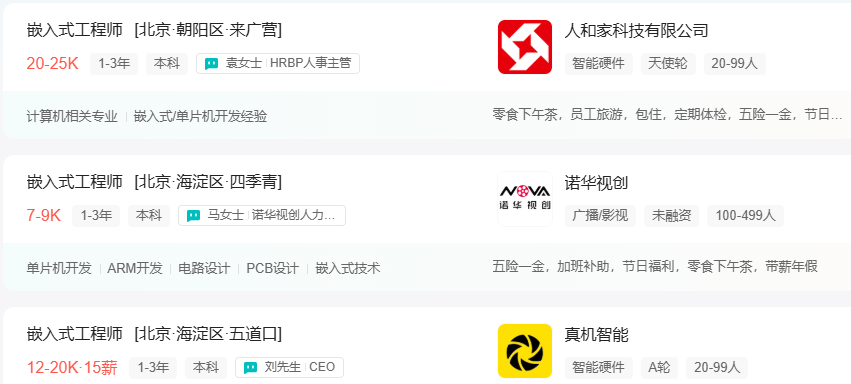
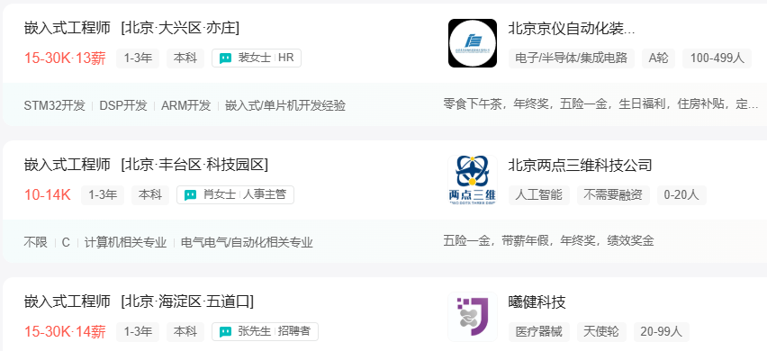

# 嵌入式介绍

# 一、什么是嵌入式
## 嵌入式系统的组成

嵌入式系统由硬件和软件组成。

+ 硬件工程师设计硬件
+ 软件工程师负责写硬件上运行的代码
+ 核心是实现智能控制

## 嵌入式系统的主要功能
+ 数据收集、处理、显示、通信、控制
+ 比如：

## 嵌入式的应用
+ 智能家电
+ 可穿戴设备
+ 汽车
+ 医疗设备
+ 工业自动化
+ 航空航天
+ 军事
+ 通讯
+ 智慧农业
+ 电子玩具
+ 等等

# 二、嵌入式发展前景
## 国家政策
**“十四五”发展规划**

+ 瞄准人工智能、量子信息、**集成电路**、生命健康、脑科学、生物育种、航天科技、深地深海等前沿领域，实施一批具有前瞻性、战略性的国家重大科技项目。
+ 支持外商投资企业通过境内再投资进一步完善产业链布局，引导外商投资投向**集成电路**、数字经济、新材料、生物医药、高端装备、研发、现代物流等产业，推动高端高新产业外商投资集聚发展。
+ 经过多年部署，我国目前主要有四个**集成电路**产业集聚区，分别是以上海为中心的长三角、以北京为中心的京津环渤海、以深圳为中心的泛珠三角和以武汉、成都为代表的中西部区域。等等。

## 薪资待遇
数据来源：Boss直聘北京区域

**没有年龄危机，越老越吃香!**

对于个人而言，学习嵌入式更加容易形成自己的技术壁垒和护城河不可替代性就越强。随着工作年限的增加，薪资也会不断的增长。

# 三、嵌入式学习哪些内容
## 相关技术
计算机组成原理、**Linux操作系统**、51单片机、STM32单片机、数据结构、C语言、以太网、LoRa、蓝牙、WIFI、驱动开发、电学基础、模电基础、数电基础、常用元器件、Zigbee、定时器、LCD、数码管、滤波、LED灯、万用表使用、RAM、ROM、各种项目实战等等等等。

# 四、嵌入式职业规划
## 职业规划

> 更新: 2025-03-04 15:10:40  
> 原文: <https://www.yuque.com/u41736172/az9urv/ikeo1nqtq2k3fqo4>